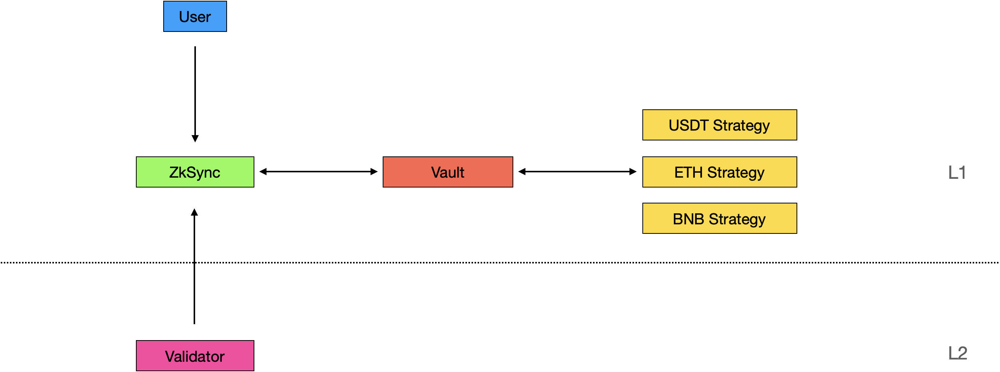

# ZkLink contracts architecture

This document covers the structure of ZkLink Contracts.

## Core

ZkLink consists of three core modules：

* ZkLink：User deposit and withdraw in L1，blocks commit and verify from L2.
* Earn：Stake funds of ZkLink to get returns without security.
* Oracle:  Report the consistency of all crts(cross chain Zero-knowledge aggregation verification)

### ZkLink

ZkLink module contains files in`contracts` and `contratcs/zksync`

* Deposit and withdraw
* Add liquidity, remove liquidity and swap
* Block commit, verify and execute
* Emergency exit

### Earn

Earn module contains files in `contracts/vault` and `contracts/strategy`

* Transfer funds to strategy
* Withdraw funds from strategy
* Manage strategies

### Oracle

Oracle module contains files in `contracts/oracle`

* Different oracle reporters such as ChainLink, Api3
* All reporters should return the same result of a crt verify request

## Stake

Stake consists of three modules:

* Stake pool: user stake or unstake nft produced by add liquidity
* ZkLinkNft: manage the life cycle of nft
* ZKL: token reward to liuqidity provider

### StakePool

StakePool module contains files in `contract/stake`

* Manage pools
* User stake and unstake nft
* Allocate rewards to staker users

### ZkLinkNft

ZkLinkNft module contains files in `contracts/nft`

* Mint new nft when user add liquidity to zklink
* Change status when layer2 msg executed at layer1

### ZKL

ZKL module contains files in `contract/token`

* ZKL token is a capped erc20 token
* ZKL implement `IMappingToken` interface which can be cross brided

## Permissions

There are two permissions：

* Upgrade permission
* Business permission

All upgradeable contracts must be proxied by Proxy contract. Upgradeable contracts in ZkLink:

* Governance
* Verifier
* Vault
* ZkLink

All Proxy contracts are managered by UpgradeGatekeeper，UpgradeGatekeeper can call upgradeTarget of these proxies。ZkLink is a little special，ZkLink  implement UpgradeableMaster，UpgradeableMaster is used as mainContract in UpgradeGatekeeper。

Contrats contain business permission are：

| **Contract**          | **Business description**         | **Permission Owner** |
| --------------------- | -------------------------------- | -------------------- |
| **UpgradeGatekeeper** | Upgrade Proxy                    | governor             |
| **Governance**        | Token manage                     | governor             |
|                       | Validator manage                 | governor             |
|                       | Nft manage                       | governor             |
|                       | Oracle reporter manage           | governor             |
| **Vault**             | Deposit record and withdraw      | zkLink               |
|                       | Strategy manage                  | governor             |
| **ZkLink**            | Block commit, verify and execute | validator            |
| **ZKL**               | Mint                             | governor and zkLink  |
| **Strategy**          | Harvest                          | stakePool            |
| **StakePool**         | Pool manage                      | governor             |
| **ZkLinkNFT**         | NFT status manage                | zkLink               |

governor will be a multiowner wallet or a timelock executor controlled by dao.
